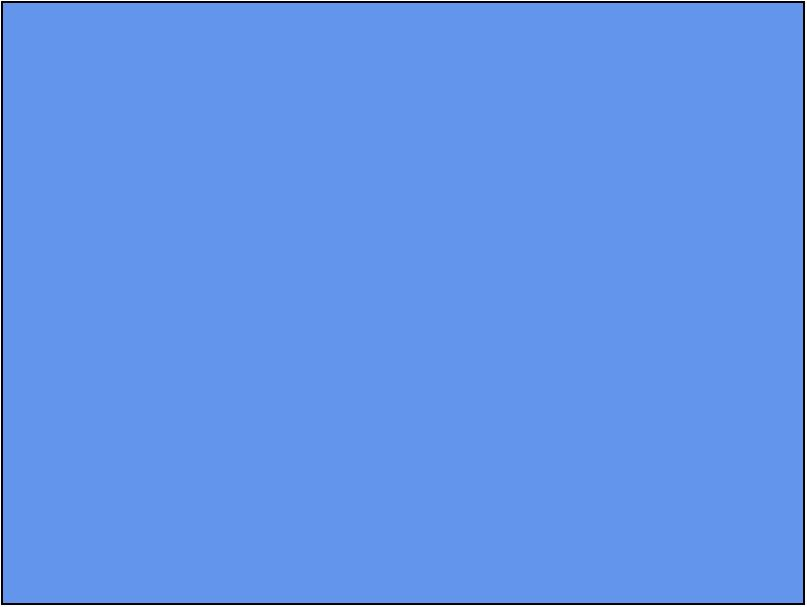

# XNA-Typescript
C# XNA port to Typescript

This is an early attempt to convert the C# XNA library to Typescript.
 Drawing is 2d only at the moment via the HTML Canvas.

    /// 

    /// This is the main type for your game
    /// 

    export class TestGame extends Game {
        graphics: GraphicsDeviceManager;
        spriteBatch: SpriteBatch;

        constructor() {
            super();
            this.graphics = new GraphicsDeviceManager(this);
            this.Content.RootDirectory = "Content";
        }

        /// 

        /// Allows the game to perform any initialization it needs to before starting to run.
        /// This is where it can query for any required services and load any non-graphic
        /// related content.  Calling base.Initialize will enumerate through any components
        /// and initialize them as well.
        /// 

        protected Initialize(): void {
            // TODO: Add your initialization logic here
            super.Initialize();
        }

        /// 

        /// LoadContent will be called once per game and is the place to load
        /// all of your content.
        /// 

        protected LoadContent(): void {
            // Create a new SpriteBatch, which can be used to draw textures.
            this.spriteBatch = new SpriteBatch(this.GraphicsDevice);

            // TODO: use this.Content to load your game content here
        }

        /// 

        /// Allows the game to run logic such as updating the world,
        /// checking for collisions, gathering input, and playing audio.
        /// 

        /// <param name="gameTime">Provides a snapshot of timing values.</param>
        protected Update(gameTime: GameTime): void {
            // TODO: Add your update logic here
            super.Update(gameTime);
        }

        /// 

        /// This is called when the game should draw itself.
        /// 

        /// <param name="gameTime">Provides a snapshot of timing values.</param>
        protected Draw(gameTime: GameTime): void {
            this.GraphicsDevice.Clear(Color.CornflowerBlue);
        }

}

Will yield something like this:

